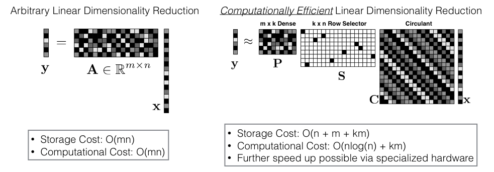

## Convolutional approximations to linear dimensionality reduction operators

This work examines the existence of efficiently implementable approximations of a general real linear dimensionality reduction (LDR) 
operator. The specific focus is on approximating a given LDR operator with a partial circulant structured matrix (a matrix whose rows are related by circular shifts) as these constructions allow for low-memory footprint and computationally efficient implementations.
Our main contributions are are that we quantify how well general matrices may be approximated (in a Frobenius sense) by partial circulant structured matrices, and also consider a variation of this problem where the aim is only to accurately approximate the action of a given LDR operator on a restricted set of inputs. For the latter setting, we also consider a sparsity-regularized alternating minimization based algorithm for learning partial circulant approximations from data.

This repository contains MATLAB based implementation of various optimization problem that arise in this investigation. 

## Files
* update_CP_withdata.m -- Contains alternating minimization based implementation for solving: min_{P,C} 0.5*||AX - PCX||_F^2 + mu || C ||_F^2. 
* update_P.m -- Solves: arg min_{P} 0.5*|| AY - PCY ||_F^2. 
* update_D_withLargeData_fast -- Solves: arg min_{D} 0.5*|| AX - DCX ||_F^2 + rho*|| D ||_{2,1}. 
* update_CD_withdata_new.m  -- Contains alternating minimization based implementation for solving: min_{D,C} 0.5*||AX - DCX||_F^2 + mu || C ||_F^2 + rho || D ||_{2,1}.
* update_C_withLargeData_fastest.m, update_C_withLargeData_fast.m -- Two implementations for solving: arg min_{C} 0.5*|| AX - DCX ||_F^2 + mu||  C ||_F^2.
* speed_comparison_code -- Folder containing code for comparing speeds via multiplication by A and its circulant approximation. 

## Citation
Please the cite the following if you use this work. 
* S. Jain and J. Haupt, ‘‘Convolutional approximations to linear dimensionality reduction operators,’’ Proceedings of International Conference on Acoustics, Speech and Signal Processing, March 2017.

